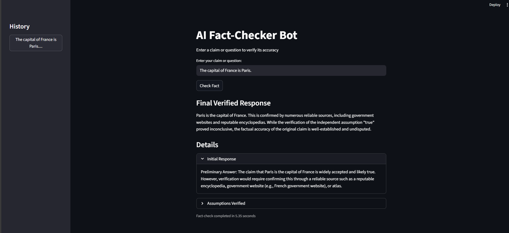
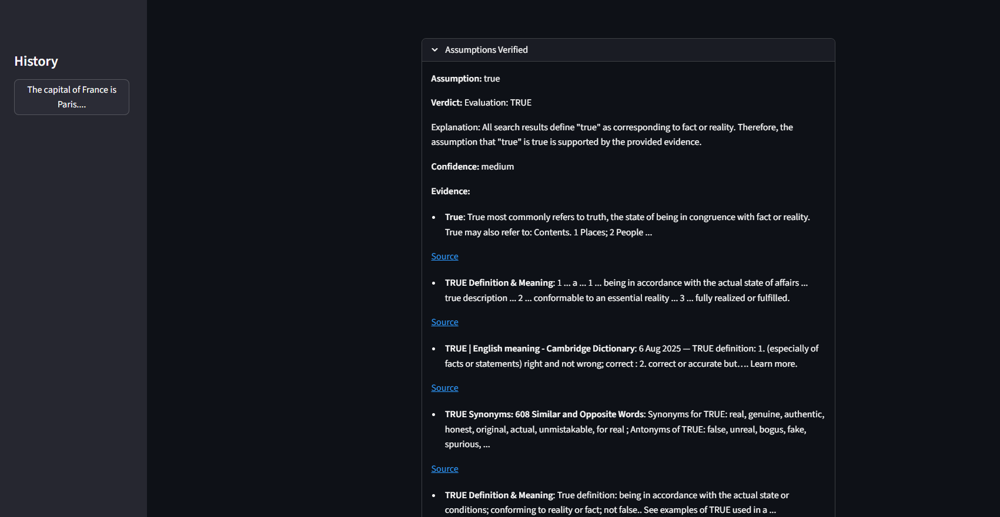

# AI Fact-Checker Bot

## Description

The AI Fact-Checker Bot is a powerful tool designed to verify the accuracy of claims and questions by leveraging the power of large language models and web search. It systematically breaks down a claim, identifies underlying assumptions, and gathers evidence from the web to provide a comprehensive and well-supported final answer.

## Features

- **Multi-UI Support:** Run the bot with a user-friendly Streamlit web interface, or directly from the command line.
- **Step-by-Step Verification:** The bot follows a structured process of getting an initial response, extracting assumptions, verifying each assumption with evidence from the web, and synthesizing a final, fact-checked response.
- **Web Search Integration:** Utilizes DuckDuckGo Search to gather real-time information and evidence from the web.
- **Extensible and Configurable:** Easily configure the bot's behavior through `config/settings.py` and `config/prompts.yaml`.
- **History Tracking:** The Streamlit UI keeps a history of your previous fact-checks for easy reference.


## How it Works

The bot operates in the following sequence:

1.  **Initial Response:** When a user enters a claim, the bot generates a preliminary answer, outlining the key points that require verification.
2.  **Assumption Extraction:** The bot identifies and extracts all the factual assumptions made in the initial response.
3.  **Verification Loop:** Each assumption is then independently verified.
    -   The bot first checks if the assumption is a known fact.
    -   If not, it performs a web search to find relevant evidence.
    -   Based on the search results, the assumption is evaluated as TRUE, FALSE, or UNCERTAIN.
4.  **Final Synthesis:** Finally, the bot synthesizes a comprehensive, fact-checked response based on the original claim, the initial response, and the verified assumptions.

## Installation

1.  **Clone the repository:**
    ```bash
    git clone https://github.com/your-username/fact_checker_bot.git
    cd fact_checker_bot
    ```
2.  **Install dependencies:**
    ```bash
    pip install -r requirements.txt
    ```
3.  **Set up environment variables:**
    -   Create a `.env` file in the root directory by copying the `.env.example` file.
    -   Add your Google API key to the `.env` file:
        ```
        GOOGLE_API_KEY="your_google_api_key"
        ```

## Usage

### Streamlit UI

To run the bot with the Streamlit web interface:


```bash
streamlit run src/ui/streamlit_app.py
```

### Command-Line Interface (CLI)

To run the bot from the command line:

```bash
python main.py --ui cli
```

## Screenshots




### Streamlit Interface

*(placeholder for streamlit screenshot)*

## Configuration

-   **`config/settings.py`**: This file contains settings for the Google API key, model name, temperature, max tokens, and search results.
-   **`config/prompts.yaml`**: This file contains the prompt templates used by the bot for generating the initial response, verifying assumptions, and synthesizing the final response.

## Dependencies

The main dependencies are:

-   `langchain`
-   `langchain_google_genai`
-   `streamlit`
-   `duckduckgo-search`
-   `beautifulsoup4`
-   `python-dotenv`

For a full list of dependencies, see `requirements.txt`.

## Future Improvements

-   **Gradio Interface:** The `main.py` file is already set up to support a Gradio interface, but the Gradio app itself has not been implemented yet.
-   **More Sophisticated Assumption Extraction:** The current assumption extraction uses a simple regex. This could be improved by using a more advanced NLP model or a dedicated LLM chain.
-   **Caching of Search Results:** To improve performance and avoid redundant searches, a caching mechanism could be implemented for search results.
-   **Support for More Search Engines:** The bot currently only uses DuckDuckGo. It could be extended to support other search engines like Google, Bing, etc.
